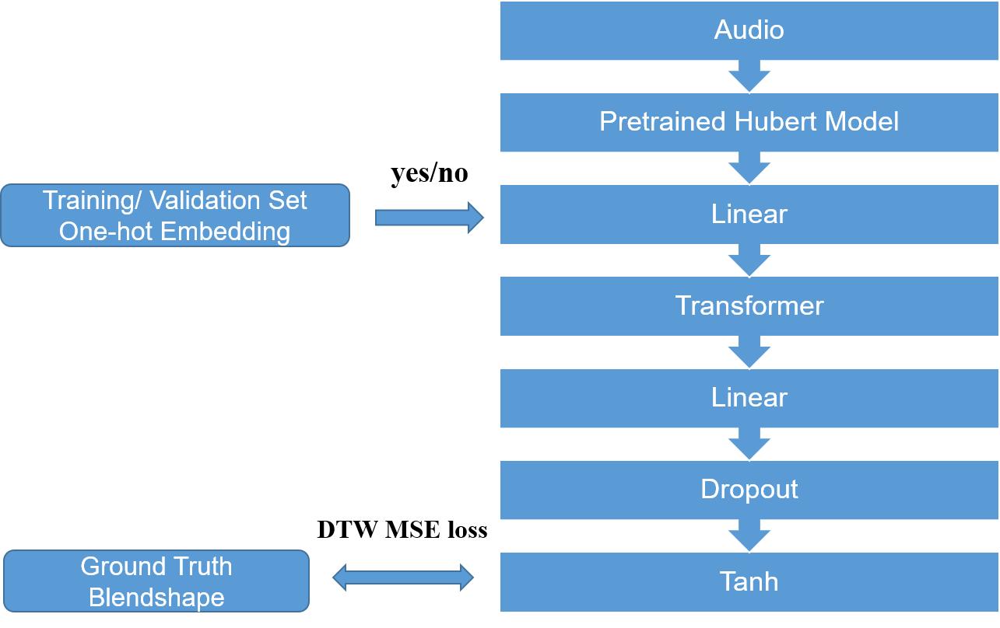
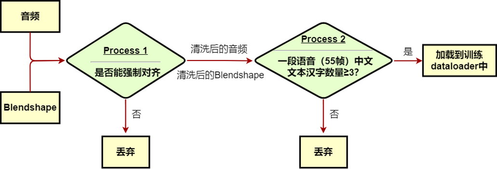
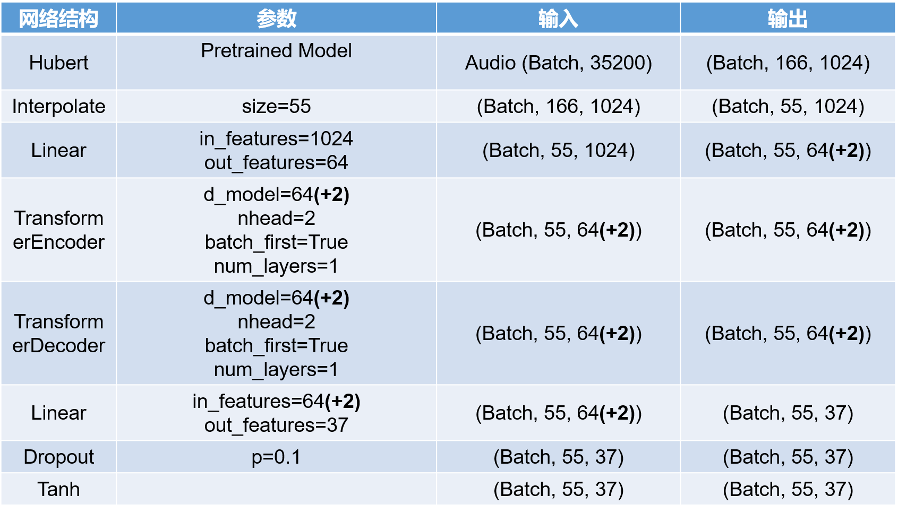
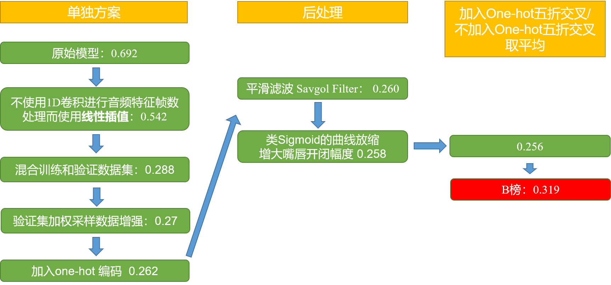
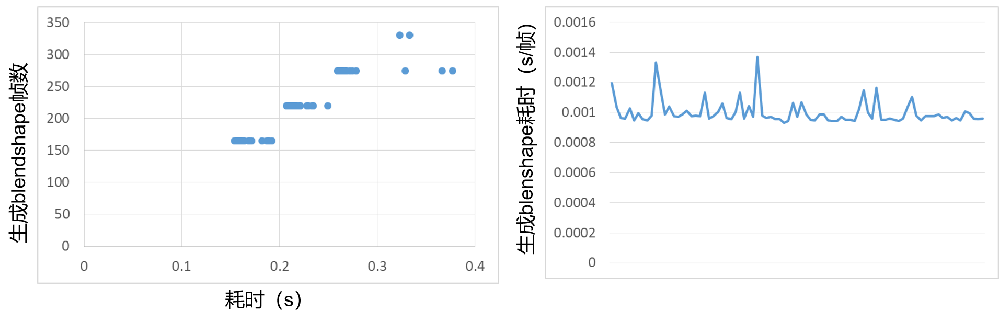

# Speech-Driven Expression Blendshape Based on Single-Layer Self-attention Network

### HelloWorld: 9th

<div align=center>

</div>

For more contest details, please refer to [official website](http://www.aiwin.org.cn/competitions/69).

## 1. Data Process

The data provided here is Not complete data. 
Due to copyright issues, please request the dataset on the [official website](http://www.aiwin.org.cn/competitions/69).

Distribution of speech frame lengths:

<div align=center>

</div>

Run

```
conda create -n aligner -c conda-forge montreal-forced-aligner python=3.8
conda activate aligner
conda config --add channels conda-forge
conda install montreal-forced-aligner
mfa models download acoustic mandarin_mfa
mfa model download dictionary mandarin_mfa
mfa model inspect acoustic mandarin_mfa      # View the acoustic model
```

Then

<div align=center>

</div>


```
pip install -r requirement1.txt
python data_process/process.py
```

## 2. Train model

### 2.1 Dependencies

python 3.7

```
conda create -n AIWIN python=3.7
conda activate AIWIN
cd <path to your project>`
pip install -r requirements.txt
```

### 2.2 Make lmdb data

`python My/scripts/aiwin_dataset_to_lmdb.py ./data`

Copy the output and paste to `Tri/config/multimodal_context.yml`, such as:
```
data_mean: [0.07876, 0.00280, 0.01174, 0.18354, 0.10486, 0.16363, 0.10860, 0.00205, 0.01784, 0.22835, 0.22417, 0.00615, 0.00558, 0.06443, 0.06593, 0.18330, 0.17782, 0.06199, 0.04290, 0.04572, 0.19684, 0.03967, 0.03928, 0.29169, 0.29800, 0.05240, 0.04886, 0.17750, 0.17757, 0.09945, 0.00002, 0.00002, 0.01264, 0.12944, 0.12708, 0.08526, 0.08594]
data_std: [0.04059, 0.00566, 0.01210, 0.11373, 0.09498, 0.11489, 0.10505, 0.01894, 0.02042, 0.14744, 0.14685, 0.01871, 0.01970, 0.02078, 0.02137, 0.05933, 0.05742, 0.04199, 0.04282, 0.02453, 0.08287, 0.00617, 0.00626, 0.16426, 0.16778, 0.02844, 0.02643, 0.04753, 0.04750, 0.04343, 0.00047, 0.00047, 0.00456, 0.04094, 0.04016, 0.01510, 0.01562]
```

If you meet 

```
(AIWIN) [yangsc21@mjrc-server11 AIWIN]$ python My/scripts/aiwin_dataset_to_lmdb.py ./data
Traceback (most recent call last):
  File "My/scripts/aiwin_dataset_to_lmdb.py", line 7, in <module>
    import pyarrow
  File "/ceph/home/yangsc21/anaconda3/envs/AIWIN/lib/python3.7/site-packages/pyarrow/__init__.py", line 49, in <module>
    from pyarrow.lib import cpu_count, set_cpu_count
ImportError: libcrypt.so.1: cannot open shared object file: No such file or directory
```

Try to check `whereis libcrypt.so.1` and `ln /usr/lib/libcrypt.so libcrypt.so.1`

```
export LD_LIBRARY_PATH=$LD_LIBRARY_PATH:"/usr/lib/libcrypt.so.1.0"
```

### 2.3 Pretrained Model

```
mkdir <your_home_dir>/chinese-hubert-large
```

Download `TencentGameMate/chinese-hubert-large` from [here](https://huggingface.co/TencentGameMate/chinese-hubert-large/tree/main).

And put it to `<your_home_dir>/chinese-hubert-large`

### 2.4 Train

<div align=center>

</div>

```
cd Tri/scripts
python train.py --config=<..your path/Tri/config/multimodal_context.yml>
```

### 2.5 Inference

```
python synthesize.py --ckpt_path "... your path/result/output_myfastdtw_batchfist_interpolate_normalize_dropout_data_decoder_val3_5_4_onehot/train_multimodal_context/multimodal_context_checkpoint_326.bin" --transcript_path "... your path/data/val/tsv/A10.tsv" --wav_path "... your path/data/val/wav/A10.wav"
```

## 3. PostProcess

Modify paths in `data_process`.

Run `postprocess.py` to smooth the output.

Run `postprocess_3.py` to deflate the output.

Run `postprocess_2.py` to perform a weighted average of the results from multiple models.

Run `add_eye` to select suitable eye expressions from the training and validation sets to add. 
Methodology for adding: Find the closest csv file with frame number greater than or equal to the generated Blendshape in the training and validation sets, and intercept the eye action with the generated Blendshape frame number as the added eye action.
Frame count in the training and validation sets:
<div align=center>

</div>

## 4. Model performance

<div align=center>

</div>

Average time to process 1s audio: 0.025s

<div align=center>

</div>

## 5. Visualization

Download `.fbx` model (e.g. by iphone) and you can use `blender.py` based on blender to visualize the blendshape file `.csv` like this:

https://user-images.githubusercontent.com/37477030/188285980-f06761c6-7ac9-4530-849e-3ed6e98b980a.mp4

The final video rendering (like [申䒕雅](https://www.bilibili.com/video/BV1w44y1M7Ry?zw&vd_source=6fcf4508482a4538987b83aa1087d7da)) of the subjective evaluation is generated by the organizer based on the `.csv` blendshape file. Due to copyright issues not shown here.

## 6. Conclusion

<div align=center>

</div>

As you can see, our model is fairly simple, and just **analyzing the data** and processing it can be a very significant improvement to the results.
Please feel free to contact me (yangsc21@mails.tsinghua.edu.cn) with any question or concerns.

## 7. [new!] pretrained model
please see `./result/`

